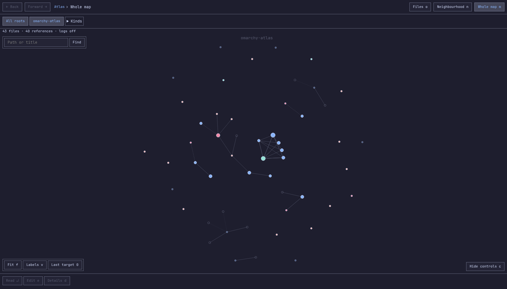
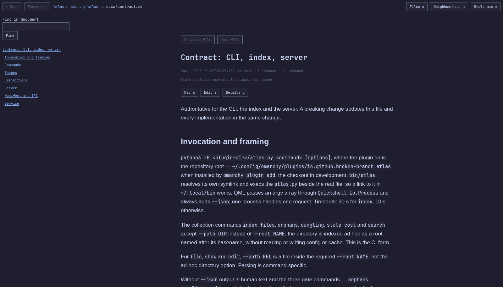

# Atlas

Atlas is an Omarchy plugin that maps the Markdown files in folders you
register. It shows which files link to which, files nothing links to, broken
links, docs older than the code they describe, and the approximate size of
the instruction files each AI coding agent loads when a session starts
(`CLAUDE.md`, `AGENTS.md`, `GEMINI.md`, Copilot, Cursor, Windsurf and Cline
rules). It never edits, moves or renames a
file.

Atlas has three parts that share one index:

- a bar widget whose popup holds search, roots, findings and file facts;
- a reader and map in the browser, opened as an Omarchy web app, following
  the active Omarchy theme;
- the `atlas` command line, for you, your agents and CI.





## Requirements

- Omarchy with its shell plugins (`omarchy plugin add`, the bar and the
  `qs.Ui` / `qs.Commons` panel API).
- `python3` and `git`. Atlas uses only the Python standard library.
- A Chromium-based default browser for the reader, which Omarchy opens as a
  web app (`omarchy-launch-or-focus-webapp`).

All of these ship with Omarchy. Nothing else is installed: the reader's
libraries are pinned files in `reader/vendor/`.

## Install

```sh
omarchy plugin add https://github.com/broken-branch/omarchy-atlas.git --enable
mkdir -p ~/.local/bin
ln -s ~/.config/omarchy/plugins/io.github.broken-branch.atlas/bin/atlas ~/.local/bin/atlas
```

The link puts `atlas` on your `PATH`. Without it, call the command by its
full path: `~/.config/omarchy/plugins/io.github.broken-branch.atlas/bin/atlas`.

The Atlas mark appears in the bar, and the plugin's service starts the
reader's server on `127.0.0.1:4137`. Update with
`omarchy plugin update io.github.broken-branch.atlas`. If an open shell still
shows the old popup after an update, run `omarchy restart shell` once.

## First root

Nothing is indexed until you add a root, a folder Atlas may read:

```sh
atlas root-add ~/Projects
atlas index
```

A root can be one project, a whole projects folder, a drive's mount point or
`/`. `--name NAME` gives it a different name; two roots with the same folder
name need one. The popup's Roots page adds the same three ways: Whole system,
A drive, or A path. `atlas roots` lists them and `atlas root-remove NAME`
removes one; removing a root never touches its files.

In a git repository Atlas lists files with `git ls-files`, so the project's
own ignore rules apply, and dates a file by its last commit. Outside git it
walks the folder, skips `node_modules`, `.venv`, `build` and similar
directories, and uses the file's modification time.

## Using Atlas

**Popup.** Click the Atlas mark in the bar, or run
`omarchy-shell io.github.broken-branch.atlas toggle` (also `open` and
`close`). The popup shows the roots, the findings (orphan files, dangling
references, stale files), All files and the map. Pick a file to see its
facts: kind, date, references in and out. Atlas sets no key binding; to add
one, bind that command in `~/.config/hypr/bindings.lua`. Right-clicking the
mark opens the selected file in the reader.

**Reader.** Opens a document with headings, tables, task lists, highlighted
code, Mermaid diagrams, an outline and a backlinks footer. Links between
files work in every reference style Atlas indexes. The header has Back,
Forward and Files; Previous file and Next file walk the list you opened the
document from; Edit opens it in the Omarchy default editor. The reader
reloads when a file changes and restyles when the theme changes.

**Map.** Neighbourhood shows one document with the files it links to and the
files that link to it. Whole map shows every file as a node and every
reference as a line, coloured by kind and grouped by root. Hover to isolate a
file's links, drag to pan, scroll to zoom, search to fly to a file, click to
select it, Enter to read it. Orphans sit at the edge, broken link targets are
hollow, stale files are ringed. Log files are hidden until you turn them on
in the Kinds filter.

From the command line, `atlas show --root NAME --path REL` opens a file in
the reader and `--map` opens it in the whole map.

### Keys

Keys never act while you type in a search field or other text entry.

| Key | Popup | Reader | Whole map |
| --- | --- | --- | --- |
| `/` | Search paths, titles and content | Find in document | Search and fly to a file |
| `j` / `k`, Down / Up | Next / previous row | Scroll, or next / previous row in a list | Next / previous file |
| `l` / Right | Open a file's facts | Activate the focused link or row | Read the selected file |
| Enter | Read the file | Activate the focused control or link | Read the selected file |
| Backspace / `h` / Left | Previous page | Back | Back |
| Esc | Clear search, then close the popup | Clear search, close an overlay | Clear search, clear the selection |
| `o` | Read the file | Files picker | Files picker |
| `n` | — | Neighbourhood | Whole map, from a neighbourhood |
| `m` | Whole map at the file | Whole map at the file | Centre the current target |
| `e` | Edit the file | Edit the file | Edit the selected file |
| `d` | File facts | Details | Details |
| `t` | — | Outline | — |
| `b` | — | Backlinks | — |
| `r` | Re-index | Refresh | Refresh |
| `f` | — | Fit the neighbourhood graph | Fit to view |
| `0` | — | — | Back to the last `atlas show` target |
| `v` | — | Neighbourhood labels on / off | Labels on / off |
| `c` | — | — | Hide / show the controls |
| `+` / `-` | — | Zoom the neighbourhood graph | Zoom |
| Alt+Left / Alt+Right | — | Browser back / forward | Browser back / forward |

Right-click a node in the map to hold it in place or release it.

## Command line

`atlas --help` lists every command. The ones you use most:

| Command | Reports |
| --- | --- |
| `atlas orphans` | Files nothing refers to. Readmes, agent instruction files and logs are entry points and are left out; `--all` lists them separately. |
| `atlas dangling` | Markdown links, `[[wikilinks]]` and `@path` imports whose target does not exist. |
| `atlas stale` | Docs whose sources changed after the doc did (see [Stale files](#stale-files)). |
| `atlas cost` | Approximate size of the instruction files an agent loads for each root. |
| `atlas search QUERY` | Paths, titles and lines that contain QUERY. |
| `atlas files`, `atlas file` | The indexed files, or one file's facts and content. |

Each collection command takes `--root NAME` for one registered root, or
`--path DIR` to index a directory on the spot without reading or writing any
Atlas state. Kinds (instructions, readmes, plans, logs and others) colour the
map; `atlas kinds` lists them and `atlas kind-set` adds or changes one.
`--json` gives programs one JSON object per call; the shapes are
in [docs/contract.md](docs/contract.md).

Report commands read the saved index and re-index first when it is older
than 2 s; `--path` always indexes fresh.

Exit codes in text mode:

| Code | Meaning |
| --- | --- |
| 0 | No findings, or a report command succeeded |
| 1 | `orphans`, `dangling` or `stale` found something |
| 2 | Malformed arguments |
| 3 | An error, such as no roots, a missing root or an unreadable file |

With `--json`, a written reply exits 0 whether it holds data or an error;
read its `ok` field. `stale` exits 0 when a root has no impact map and
prints an `unavailable` line for it instead.

### In CI

Atlas needs only `python3` and `git`, so it runs in your own repository's CI
without Omarchy. A GitHub Actions job:

```yaml
jobs:
  docs:
    runs-on: ubuntu-latest
    steps:
      - uses: actions/checkout@v4
        with:
          fetch-depth: 0
      - run: git clone --depth 1 https://github.com/broken-branch/omarchy-atlas.git "$RUNNER_TEMP/atlas"
      - run: python3 -B "$RUNNER_TEMP/atlas/atlas.py" dangling --path .
      - run: python3 -B "$RUNNER_TEMP/atlas/atlas.py" stale --path .
```

Run it from your repository's root; `--path .` indexes that checkout.
`fetch-depth: 0` gives Atlas each file's real last-commit time, which `stale`
compares. There is no exclude option, so `orphans` also reports test
fixtures and other Markdown that is not meant to be linked; choose the
checks that fit your repository.

## Stale files

A doc is stale when a source it describes changed after the doc did. Atlas
only measures this where you say what each doc depends on, in
`docs/impact.yml` at the root of a project. Despite its name the file must
be JSON:

```json
{
  "rules": [
    {"source": ["src/**"], "docs": ["docs/guide.md"]},
    {"source": ["lib/**", "cli.py"], "docs": ["docs/cli.md", "README.md"]}
  ]
}
```

Each rule pairs `source` globs with the `docs` globs that describe them,
relative to the project root. A doc is stale when the newest file matching
its rule's `source` is newer than the doc. Without the file, `stale` lists
the root as unavailable with `impact map absent`; with invalid JSON, with
`impact map unreadable`. Atlas never guesses a dependency.

## Instruction cost

`atlas cost` estimates, per root and per agent, what a session loads before
you type anything, so you can see which instruction files are worth
trimming. An agent gets a row when it has at least one startup file; files
in your home folder alone are enough:

| Agent | Loaded at startup |
| --- | --- |
| Claude Code | `CLAUDE.md`, `.claude/CLAUDE.md`, `CLAUDE.local.md`, `.claude/rules/*.md`, `~/.claude/CLAUDE.md`, the first 200 lines of the project's auto memory `MEMORY.md`, and every `@path` they import |
| Codex | `AGENTS.md`, `~/.codex/AGENTS.md` |
| Gemini CLI | `GEMINI.md`, `~/.gemini/GEMINI.md`, and their `@path` imports |
| GitHub Copilot | `.github/copilot-instructions.md`, `.github/instructions/*.instructions.md` |
| Cursor | `.cursor/rules/*.mdc` with `alwaysApply: true`, `.cursorrules` |
| Windsurf | `.windsurf/rules/*.md`, `.windsurfrules` |
| Cline | `.clinerules` (a file or a directory) |

Claude Code counts `AGENTS.md` only when a startup file imports it with
`@AGENTS.md`.

Each row leads with the startup total and lists the startup files largest
first. A second, separate figure counts what those files only mention, plus
nested instruction files and Claude skills, agents and commands: an agent
reads those when it needs them, so they are not added to the startup total.
A file several agents read appears in each of their rows. Tokens are
estimated as bytes ÷ 4 — an approximation, not a tokenizer count — and
Atlas calls no model and needs no account.

## What Atlas reads and writes

- **Roots, read-only.** Atlas reads files only inside the roots you
  register, and follows `@path` imports only inside those roots and your
  home folder. Files that look like credentials (`.env`, keys and similar)
  are never indexed or served.
- **Its own state.** `~/.config/omarchy-atlas/config.json` holds your roots
  and kinds; `~/.cache/omarchy-atlas/index.json` holds the index. Atlas
  writes nothing else, and nothing into a project or the plugin folder.
- **Agent files for cost.** `~/.claude/CLAUDE.md`, `~/.codex/AGENTS.md`,
  `~/.gemini/GEMINI.md` and `~/.claude/projects/*/memory/MEMORY.md`, read
  only for `atlas cost`.
- **Theme.** The current Omarchy `colors.toml` and `shell.toml`, and
  `hyprctl` for corner rounding, so the reader matches the desktop.
- **Server.** `127.0.0.1:4137`, local only, no accounts. It serves the
  reader and files inside registered roots to programs on this computer.
- **No network.** No requests beyond `127.0.0.1`, no telemetry, no model
  calls.

## Troubleshooting

- **The reader says it cannot load.** The server is not running. Check that
  the plugin is enabled (`omarchy plugin list`); from a plain checkout, run
  `python3 -B atlas.py serve`. The service restarts the server 2 s after it
  exits, backing off to 30 s after five exits in a minute.
- **Port 4137 is taken.** The server exits with a one-line reason in the
  shell's log and the service keeps retrying. Stop the other program on that
  port (`ss -ltnp 'sport = :4137'` names it); Atlas starts on the next retry.
- **A root moved or was deleted.** The other roots keep working; every
  command lists the missing one as `unavailable NAME root missing`, and
  `--root NAME` for it replies `invalid_root`. Restore the directory, or run
  `atlas root-remove NAME` and add the new location.
- **A file is missing from the index.** In a git repository, check that git
  tracks it or would add it (`git status`); ignored files are left out.

## Removal

```sh
omarchy plugin remove io.github.broken-branch.atlas
rm -rf ~/.config/omarchy-atlas ~/.cache/omarchy-atlas
rm ~/.local/bin/atlas
```

The first line removes the plugin and stops its server. The second removes
your roots and the index; the third removes the link, if you made one.

## Documentation

- [Documentation index](docs/index.md): every document below in one list.
- [Using Atlas](docs/features.md): the flow from first root to the map.
- [CLI, index and server reference](docs/contract.md): commands, JSON
  shapes, HTTP routes, and the exact definitions of orphan, dangling, stale
  and cost.
- [Stack](docs/stack.md): how Atlas is built and why.
- [Contributing](CONTRIBUTING.md).

## License

MIT, see [LICENSE](LICENSE). The reader's bundled libraries keep their own
licences; see [reader/vendor/NOTICE](reader/vendor/NOTICE).
