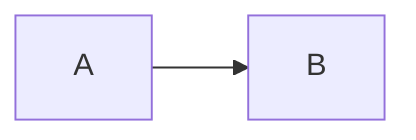

# Reader guide

## Next steps

[Guide](../guide.md#next-steps) and [[Guide|Wiki guide]] and `docs/guide.md`.

[Lost](missing.md) and [[Missing]].

- [x] Finished
- [ ] Pending

| Name | Value |
| --- | --- |
| ~~Old~~ | New |


<script>alert('unsafe')</script>

```python
print("hello")
```



## Next steps
